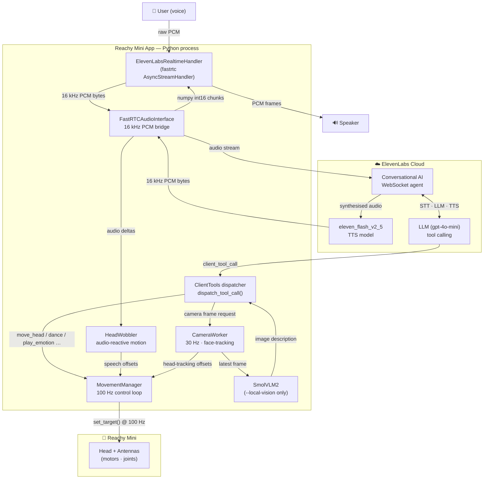

# Reachy Mini conversation app

Conversational app for the Reachy Mini robot combining **ElevenLabs Conversational AI** (voice + LLM), vision pipelines, and choreographed motion libraries.


## Table of contents
- [Overview](#overview)
- [Architecture](#architecture)
- [Installation](#installation)
- [Configuration](#configuration)
- [Running the app](#running-the-app)
- [LLM tools](#llm-tools-exposed-to-the-assistant)
- [Advanced features](#advanced-features)
- [Resources](#resources)
- [Contributing](#contributing)
- [License](#license)

## Overview
- Real-time audio conversation loop powered by the **ElevenLabs Conversational AI SDK** and `fastrtc` for low-latency bidirectional audio streaming.
- Voice synthesis uses **`eleven_flash_v2_5`** — ElevenLabs' lowest-latency voice model — at 16 kHz PCM.
- The LLM brain defaults to **`gpt-4o-mini`** (configurable per-agent) with full tool-calling support.
- Vision processing supports local on-device inference using SmolVLM2 via the `--local-vision` flag.
- Layered motion system queues primary moves (dances, emotions, goto poses, breathing) while blending speech-reactive wobble and head-tracking offsets at 100 Hz.
- Async tool dispatch lets the LLM control motors, capture camera frames, and toggle head-tracking — all through the same profile-based tool system.

## Architecture

The app connects voice I/O, the ElevenLabs cloud, and Reachy Mini hardware through a set of concurrent workers:



**Data flows:**

| Path | Format | Notes |
|------|--------|-------|
| Mic → ElevenLabs | 16 kHz int16 PCM bytes | Resampled from fastrtc input rate if needed |
| ElevenLabs → Speaker | 16 kHz int16 PCM bytes | Decoded from WebSocket audio frames |
| Tool call → Result | JSON | `dispatch_tool_call()` awaited inline in `ClientTools` handler |
| Camera frame | BGR uint8 NumPy array | Acquired from `CameraWorker`, optionally processed by SmolVLM2 |
| Motion offsets | 6-DOF head pose | Blended additively on top of primary moves at 100 Hz |

### First-run agent creation

On the very first launch, the handler:

1. Converts all profile tool specs (JSON Schema) to ElevenLabs `client` tool definitions.
2. Calls `client.conversational_ai.agents.create(...)` with the profile's `instructions.txt` and voice mapping.
3. Writes `ELEVENLABS_AGENT_ID=<id>` into your `.env` so subsequent runs skip creation and just call `agents.update(...)`.

## Installation

> [!IMPORTANT]
> Before using this app, you need to install [Reachy Mini's SDK](https://github.com/pollen-robotics/reachy_mini/).<br>
> Windows support is currently experimental and has not been extensively tested. Use with caution.

<details open>
<summary><b>Using uv (recommended)</b></summary>

Set up the project quickly using [uv](https://docs.astral.sh/uv/):

```bash
# macOS (Homebrew)
uv venv --python /opt/homebrew/bin/python3.12 .venv

# Linux / Windows (Python in PATH)
uv venv --python python3.12 .venv

source .venv/bin/activate
uv sync
```

> **Note:** To reproduce the exact dependency set from this repo's `uv.lock`, run `uv sync --frozen`. This ensures `uv` installs directly from the lockfile without re-resolving or updating any versions.

**Install optional features:**
```bash
uv sync --extra local_vision         # Local PyTorch/Transformers vision
uv sync --extra yolo_vision          # YOLO-based head-tracking
uv sync --extra mediapipe_vision     # MediaPipe-based head-tracking
uv sync --extra all_vision           # All vision features
```

Combine extras or include dev dependencies:
```bash
uv sync --extra all_vision --extra reachy_mini_wireless --group dev
```

</details>

<details>
<summary><b>Using pip</b></summary>

```bash
python -m venv .venv
source .venv/bin/activate
pip install -e .
```

**Install optional features:**
```bash
pip install -e .[local_vision]          # Local vision stack
pip install -e .[yolo_vision]           # YOLO-based vision
pip install -e .[mediapipe_vision]      # MediaPipe-based vision
pip install -e .[all_vision]            # All vision features
pip install -e .[dev]                   # Development tools
```

Some wheels (like PyTorch) are large and require compatible CUDA or CPU builds—make sure your platform matches the binaries pulled in by each extra.

</details>

### Optional dependency groups

| Extra | Purpose | Notes |
|-------|---------|-------|
| `local_vision` | Run the local VLM (SmolVLM2) through PyTorch/Transformers | GPU recommended. Ensure compatible PyTorch builds for your platform. |
| `yolo_vision` | YOLOv11n head tracking via `ultralytics` and `supervision` | Runs on CPU (default). GPU improves performance. Supports the `--head-tracker yolo` option. |
| `mediapipe_vision` | Lightweight landmark tracking with MediaPipe | Works on CPU. Enables `--head-tracker mediapipe`. |
| `all_vision` | Convenience alias installing every vision extra | Install when you want the flexibility to experiment with every provider. |
| `dev` | Developer tooling (`pytest`, `ruff`, `mypy`) | Development-only dependencies. Use `--group dev` with uv or `[dev]` with pip. |

**Note:** `dev` is a dependency group (not an optional dependency). With uv, use `--group dev`. With pip, use `[dev]`.

## Configuration

1. Copy `.env.example` to `.env`
2. Set `ELEVENLABS_API_KEY` — all other values are optional

| Variable | Required | Description |
|----------|----------|-------------|
| `ELEVENLABS_API_KEY` | **Yes** | ElevenLabs API key. Get one at [elevenlabs.io](https://elevenlabs.io). |
| `ELEVENLABS_AGENT_ID` | Auto | Populated automatically on first run. Set manually to pin a specific agent. |
| `OPENAI_API_KEY` | Optional | Only needed for the legacy camera-tool fallback path (without `--local-vision`). |
| `HF_HOME` | Optional | Cache directory for local Hugging Face downloads (only used with `--local-vision`, defaults to `./cache`). |
| `HF_TOKEN` | Optional | Hugging Face token for gated/private assets. |
| `LOCAL_VISION_MODEL` | Optional | HF model path for local vision (only with `--local-vision`, defaults to `HuggingFaceTB/SmolVLM2-2.2B-Instruct`). |

> **Camera + vision tip:** For the `camera` tool to describe what it sees, run with `--local-vision`. Without it, the tool captures a frame but cannot pass it to the ElevenLabs voice model (audio-only).

## Running the app

Activate your virtual environment, then launch:

```bash
reachy-mini-conversation-app
```

> [!TIP]
> Make sure the Reachy Mini daemon is running before launching the app. If you see a `TimeoutError`, it means the daemon isn't started. See [Reachy Mini's SDK](https://github.com/pollen-robotics/reachy_mini/) for setup instructions.

The app runs in console mode by default. Add `--gradio` to launch a web UI at http://127.0.0.1:7860/ (required for simulation mode). Vision and head-tracking options are described in the CLI table below.

### CLI options

| Option | Default | Description |
|--------|---------|-------------|
| `--head-tracker {yolo,mediapipe}` | `None` | Select a head-tracking backend when a camera is available. YOLO is implemented locally, MediaPipe comes from the `reachy_mini_toolbox` package. Requires the matching optional extra. |
| `--no-camera` | `False` | Run without camera capture or head tracking. |
| `--local-vision` | `False` | Use local vision model (SmolVLM2) for camera-tool image analysis. Requires `local_vision` extra. Recommended when using the `camera` tool with ElevenLabs (audio-only mode). |
| `--gradio` | `False` | Launch the Gradio web UI. Without this flag, runs in console mode. Required when running in simulation mode. |
| `--robot-name` | `None` | Optional. Connect to a specific robot by name when running multiple daemons on the same subnet. |
| `--debug` | `False` | Enable verbose logging for troubleshooting. |

### Examples

```bash
# Run with MediaPipe head tracking
reachy-mini-conversation-app --head-tracker mediapipe

# Run with local vision processing (required for camera tool to describe images)
reachy-mini-conversation-app --local-vision

# Audio-only conversation (no camera)
reachy-mini-conversation-app --no-camera

# Launch with Gradio web interface
reachy-mini-conversation-app --gradio
```

## LLM tools exposed to the assistant

| Tool | Action | Dependencies |
|------|--------|--------------|
| `move_head` | Queue a head pose change (left/right/up/down/front). | Core install only. |
| `camera` | Capture the latest camera frame. With `--local-vision` uses SmolVLM2 to describe the scene; without it returns a placeholder (ElevenLabs is audio-only). | Requires camera worker. `--local-vision` recommended. |
| `head_tracking` | Enable or disable head-tracking offsets (detects and tracks head position only — not identity recognition). | Camera worker with configured head tracker (`--head-tracker`). |
| `dance` | Queue a dance from `reachy_mini_dances_library`. | Core install only. |
| `stop_dance` | Clear queued dances. | Core install only. |
| `play_emotion` | Play a recorded emotion clip via Hugging Face datasets. | Core install only. Uses [`pollen-robotics/reachy-mini-emotions-library`](https://huggingface.co/datasets/pollen-robotics/reachy-mini-emotions-library). |
| `stop_emotion` | Clear queued emotions. | Core install only. |
| `do_nothing` | Explicitly remain idle. | Core install only. |

## Advanced features

Built-in motion content is published as open Hugging Face datasets:
- Emotions: [`pollen-robotics/reachy-mini-emotions-library`](https://huggingface.co/datasets/pollen-robotics/reachy-mini-emotions-library)
- Dances: [`pollen-robotics/reachy-mini-dances-library`](https://huggingface.co/datasets/pollen-robotics/reachy-mini-dances-library)

<details>
<summary><b>Custom profiles</b></summary>

Create custom profiles with dedicated instructions and enabled tools.

Set `REACHY_MINI_CUSTOM_PROFILE=<name>` to load `src/reachy_mini_conversation_app/profiles/<name>/` (see `.env.example`). If unset, the `default` profile is used.

Each profile should include `instructions.txt` (prompt text). `tools.txt` (list of allowed tools) is recommended. If missing for a non-default profile, the app falls back to `profiles/default/tools.txt`. Profiles can optionally contain a `voice.txt` with an ElevenLabs voice ID.

**Custom instructions:**

Write plain-text prompts in `instructions.txt`. To reuse shared prompt pieces, add lines like:
```
[passion_for_lobster_jokes]
[identities/witty_identity]
```
Each placeholder pulls the matching file under `src/reachy_mini_conversation_app/prompts/` (nested paths allowed). See `src/reachy_mini_conversation_app/profiles/example/` for a reference layout.

**Enabling tools:**

List enabled tools in `tools.txt`, one per line. Prefix with `#` to comment out:
```
play_emotion
# move_head

# My custom tool defined locally
sweep_look
```
Tools are resolved first from Python files in the profile folder (custom tools), then from the core library `src/reachy_mini_conversation_app/tools/` (like `dance`, `head_tracking`).

**Custom tools:**

On top of built-in tools found in the core library, you can implement custom tools specific to your profile by adding Python files in the profile folder.
Custom tools must subclass `reachy_mini_conversation_app.tools.core_tools.Tool` (see `profiles/example/sweep_look.py`).

**Voice selection:**

Add a `voice.txt` to your profile containing either:
- A known ElevenLabs voice ID (e.g. `21m00Tcm4TlvDq8ikWAM` for Rachel), or
- One of the mapped OpenAI-style names: `cedar`, `alloy`, `aria`, `ballad`, `verse`, `sage`, `coral`.

Browse voices at [elevenlabs.io/voice-library](https://elevenlabs.io/voice-library).

**Edit personalities from the UI:**

When running with `--gradio`, open the "Personality" accordion:
- Select among available profiles (folders under `src/reachy_mini_conversation_app/profiles/`) or the built‑in default.
- Click "Apply" to update the current session instructions live.
- Create a new personality by entering a name and instructions text. It stores files under `profiles/<name>/` and copies `tools.txt` from the `default` profile.

Note: The "Personality" panel updates the conversation instructions. Tool sets are loaded at startup from `tools.txt` and are not hot‑reloaded.

</details>

<details>
<summary><b>Locked profile mode</b></summary>

To create a locked variant of the app that cannot switch profiles, edit `src/reachy_mini_conversation_app/config.py` and set the `LOCKED_PROFILE` constant to the desired profile name:
```python
LOCKED_PROFILE: str | None = "mars_rover"  # Lock to this profile
```
When `LOCKED_PROFILE` is set, the app always uses that profile, ignoring `REACHY_MINI_CUSTOM_PROFILE` env var & the Gradio UI shows "(locked)" and disables all profile editing controls.
This is useful for creating dedicated clones of the app with a fixed personality. Clone scripts can simply edit this constant to lock the variant.

</details>

<details>
<summary><b>External profiles and tools</b></summary>

You can extend the app with profiles/tools stored outside `src/reachy_mini_conversation_app/`.

- Core profiles are under `src/reachy_mini_conversation_app/profiles/`.
- Core tools are under `src/reachy_mini_conversation_app/tools/`.

**Recommended layout:**

```text
external_content/
├── external_profiles/
│   └── my_profile/
│       ├── instructions.txt
│       ├── tools.txt        # optional (see fallback behavior below)
│       └── voice.txt        # optional — ElevenLabs voice ID
└── external_tools/
    └── my_custom_tool.py
```

**Environment variables:**

Set these values in your `.env` (copy from `.env.example`):

```env
REACHY_MINI_CUSTOM_PROFILE=my_profile
REACHY_MINI_EXTERNAL_PROFILES_DIRECTORY=./external_content/external_profiles
REACHY_MINI_EXTERNAL_TOOLS_DIRECTORY=./external_content/external_tools
# Optional convenience mode:
# AUTOLOAD_EXTERNAL_TOOLS=1
```

**Loading behavior:**

- **Default/strict mode**: `tools.txt` defines enabled tools explicitly. Every name in `tools.txt` must resolve to either a built-in tool (`src/reachy_mini_conversation_app/tools/`) or an external tool module in `REACHY_MINI_EXTERNAL_TOOLS_DIRECTORY`.
- **Convenience mode** (`AUTOLOAD_EXTERNAL_TOOLS=1`): all valid `*.py` tool files in `REACHY_MINI_EXTERNAL_TOOLS_DIRECTORY` are auto-added.
- **External profile fallback**: if the selected external profile has no `tools.txt`, the app falls back to built-in `profiles/default/tools.txt`.

This supports both:
1. Downloaded external tools used with built-in/default profile.
2. Downloaded external profiles used with built-in default tools.

</details>

<details>
<summary><b>Multiple robots on the same subnet</b></summary>

If you run multiple Reachy Mini daemons on the same network, use:

```bash
reachy-mini-conversation-app --robot-name <name>
```

`<name>` must match the daemon's `--robot-name` value so the app connects to the correct robot.

</details>

## Resources

| Resource | Description |
|----------|-------------|
| [ElevenLabs Python SDK](https://github.com/elevenlabs/elevenlabs-python) | Official Python client — `AsyncConversation`, `ClientTools`, `AsyncAudioInterface` |
| [ElevenLabs Conversational AI docs](https://elevenlabs.io/docs/conversational-ai/overview) | Overview of the agent platform and WebSocket protocol |
| [ElevenLabs Python SDK — Conversational AI](https://elevenlabs.io/docs/conversational-ai/libraries/conversational-ai-sdk-python) | Python-specific SDK guide |
| [ElevenLabs Agents API — Create agent](https://elevenlabs.io/docs/api-reference/agents/create) | REST reference for `POST /v1/convai/agents/create` |
| [ElevenLabs Client Tools](https://elevenlabs.io/docs/agents-platform/customization/tools/client-tools) | How to define and register Python-side tool handlers |
| [ElevenLabs Overrides](https://elevenlabs.io/docs/eleven-agents/customization/personalization/overrides) | `conversation_config_override` — runtime system-prompt patching |
| [ElevenLabs Voice Library](https://elevenlabs.io/voice-library) | Browse available voice IDs |
| [fastrtc](https://github.com/gradio-app/fastrtc) | Real-time audio/video streaming library used for mic/speaker bridging |
| [Reachy Mini SDK](https://huggingface.co/docs/reachy_mini/SDK/python-sdk) | Python SDK for motor control, camera, and robot state |
| [Reachy Mini SDK — GitHub](https://github.com/pollen-robotics/reachy_mini/) | Source and setup instructions |

## Contributing

We welcome bug fixes, features, profiles, and documentation improvements. Please review our
[contribution guide](CONTRIBUTING.md) for branch conventions, quality checks, and PR workflow.

Quick start:
- Fork and clone the repo
- Follow the [installation steps](#installation) (include the `dev` dependency group)
- Run contributor checks listed in [CONTRIBUTING.md](CONTRIBUTING.md)

## License

Apache 2.0
