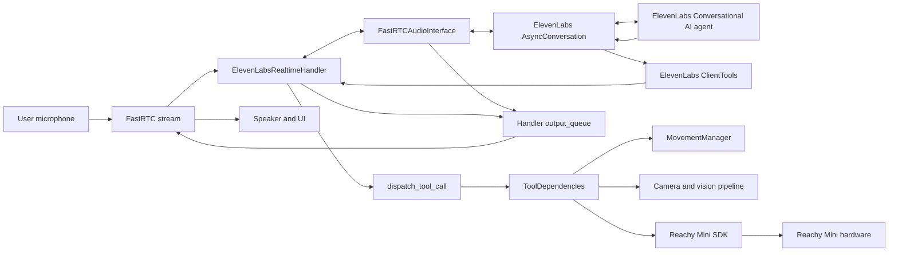
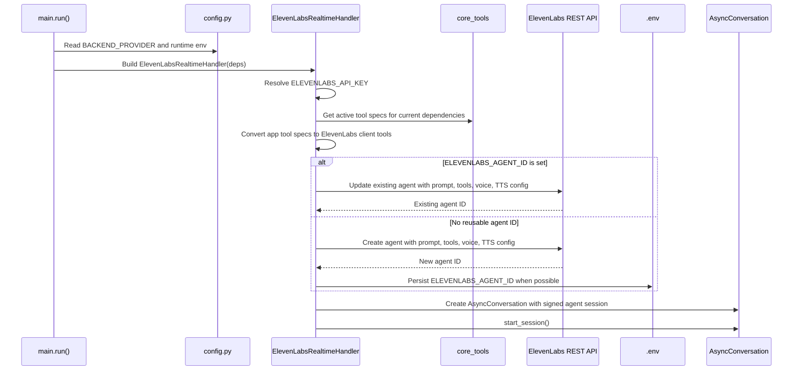
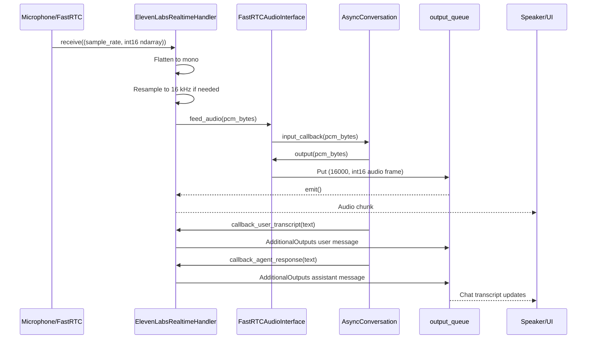
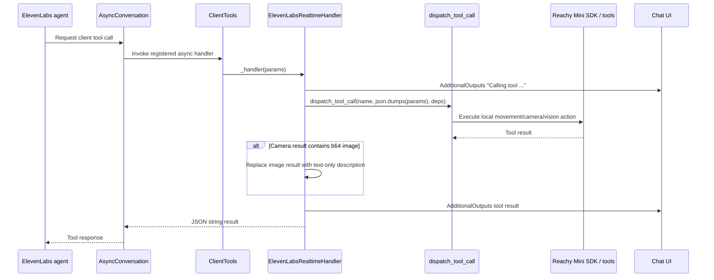
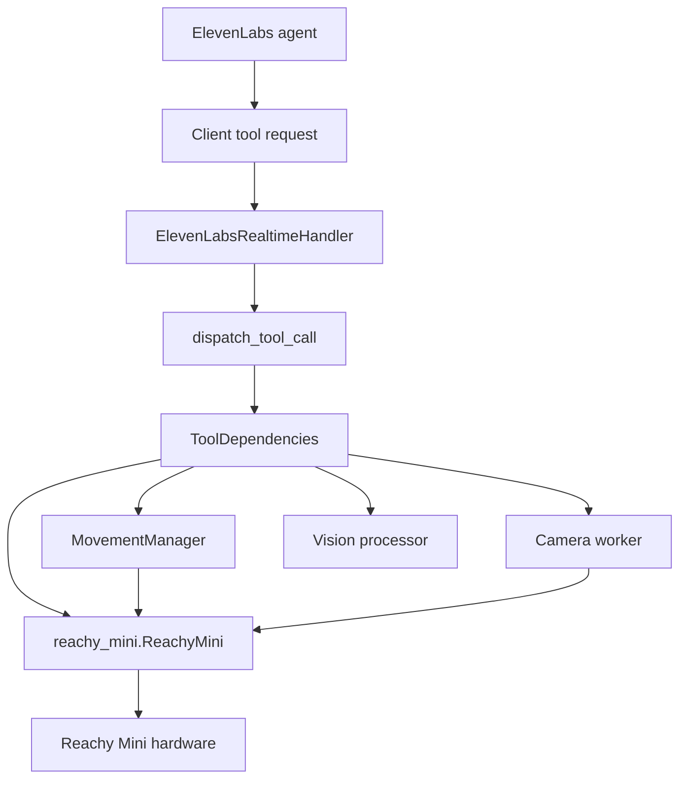

# ElevenLabs Conversational AI Integration

This document explains how the ElevenLabs Conversational AI SDK is layered on top of the Reachy Mini conversation app and the Reachy Mini SDK.

The implementation is more than a backend selector. It provisions an ElevenLabs Conversational AI agent, streams microphone and speaker audio through ElevenLabs' `AsyncConversation`, exposes the app's local robot tools as ElevenLabs client tools, and keeps the Reachy Mini SDK as the only component that directly controls the robot hardware.

## Scope

The ElevenLabs integration lives primarily in:

| Area | File | Responsibility |
|------|------|----------------|
| Runtime handler | `src/reachy_mini_conversation_app/elevenlabs_realtime.py` | ElevenLabs SDK adapter, audio bridge, tool registration, agent provisioning. |
| Backend selection | `src/reachy_mini_conversation_app/main.py` | Selects `ElevenLabsRealtimeHandler` when `BACKEND_PROVIDER=elevenlabs`. |
| Configuration | `src/reachy_mini_conversation_app/config.py` | Defines backend constants, ElevenLabs environment variables, model defaults, and voice aliases. |
| Settings UI | `src/reachy_mini_conversation_app/console.py` | Lets the UI select the ElevenLabs backend and persist the API key. |
| Robot actions | `src/reachy_mini_conversation_app/tools/` | Provides the tool specs and dispatch functions used by all backends. |

## High-Level Architecture

ElevenLabs owns the conversational turn-taking, speech recognition, agent reasoning, and text-to-speech. The Reachy Mini app owns the local stream, UI outputs, tool execution, robot connection, camera access, and motion scheduling.



## Configuration

Use these environment variables to enable the backend:

```env
BACKEND_PROVIDER=elevenlabs
ELEVENLABS_API_KEY=<your-key>
```

Optional variables:

```env
ELEVENLABS_AGENT_ID=<existing-agent-id>
ELEVENLABS_API_BASE_URL=https://api.eu.residency.elevenlabs.io
```

Notes:

- `ELEVENLABS_AGENT_ID` is optional. If it is missing, the app creates an agent and persists the new ID to `.env` when a writable `.env` file exists.
- If `ELEVENLABS_AGENT_ID` is present, the app updates that agent on startup with the active profile prompt, tools, voice, and TTS settings.
- `ELEVENLABS_API_BASE_URL` is passed as `base_url` when constructing the ElevenLabs client, which supports custom or residency-specific endpoints.
- The handler currently provisions the agent with `ELEVENLABS_LLM_MODEL` from `elevenlabs_realtime.py`, which is `gpt-4o-mini`.

## Startup And Agent Provisioning

On startup, `main.py` builds the realtime handler for the configured backend. For `BACKEND_PROVIDER=elevenlabs`, it imports and constructs `ElevenLabsRealtimeHandler`.

The handler then ensures an ElevenLabs agent exists before opening the live conversation session.



The agent configuration includes:

| Setting | Current value/source |
|---------|----------------------|
| Agent name | `Reachy Loco` |
| Prompt | Active profile instructions from `get_session_instructions(...)` |
| LLM | `ELEVENLABS_LLM_MODEL`, currently `gpt-4o-mini` |
| First message | `Hello! I'm Reachy Loco. How can I help you?` |
| Language | `en` |
| TTS model | `ELEVENLABS_TTS_MODEL`, currently `eleven_v3_conversational` |
| Voice | Current app voice mapped to an ElevenLabs voice ID |
| Turn model | `ELEVENLABS_TURN_MODEL`, currently `turn_v3` |
| Turn mode | `turn` with `turn_timeout=7` |
| Tools | Active app tools converted to ElevenLabs client tools |

## Realtime Audio Flow

The app's stream handler interface is still the FastRTC-style `start_up`, `receive`, `emit`, and `shutdown` flow. ElevenLabs is wrapped behind `FastRTCAudioInterface`, a small adapter that implements `AsyncAudioInterface`.



Important audio details:

- ElevenLabs input and output are treated as 16 kHz, mono, signed 16-bit PCM.
- Incoming FastRTC frames are flattened to mono and resampled when their source sample rate differs.
- Agent audio is pushed into `output_queue` as `(ELEVENLABS_SAMPLE_RATE, ndarray[int16])`.
- Text transcript and tool-status UI updates are pushed into the same queue as `AdditionalOutputs`.
- When ElevenLabs interrupts output, `FastRTCAudioInterface.interrupt()` drains queued audio while preserving non-audio `AdditionalOutputs`.

## Tool Calling Flow

The ElevenLabs SDK does not execute robot actions directly. Instead, each app tool is registered as an ElevenLabs `ClientTools` handler. When the agent requests a tool, the handler dispatches the call through the same local tool system used by the other realtime backends.



The tool conversion happens in two places:

- `_build_elevenlabs_tool(...)` converts the app's OpenAI-style tool schema into an ElevenLabs agent tool definition for provisioning.
- `_build_client_tools(...)` registers async Python handlers for those tools on the live `AsyncConversation`.

Each converted tool has:

```json
{
  "type": "client",
  "name": "<tool-name>",
  "description": "<tool-description>",
  "parameters": { "type": "object", "properties": {} },
  "expects_response": true,
  "execution_mode": "immediate"
}
```

Camera behavior has one backend-specific limitation: ElevenLabs client tools return text/JSON, not images. If the `camera` tool returns a base64 image, the handler replaces the tool response with a text description telling the user to run with `--local-vision` for AI-based visual analysis. The UI can still display local outputs, but the ElevenLabs agent should not be expected to inspect the base64 image directly.

## Reachy Mini SDK Boundary

The ElevenLabs SDK never receives direct access to the robot object. Robot access stays local and flows through `ToolDependencies`.



This boundary is useful for maintenance:

- Backend code can change without rewriting individual robot tools.
- Robot tools remain reusable across OpenAI, Gemini, Hugging Face, and ElevenLabs.
- Safety and motion serialization stay inside the local movement/tool layers.
- Network access to ElevenLabs is limited to the app process. The robot is not exposed to ElevenLabs as a remote endpoint.

## Profiles, Voices, And Session Restarts

Profiles and voices are applied through the agent/session configuration:

- Prompt text comes from the active profile via `get_session_instructions(...)`.
- Voice aliases such as `cedar`, `alloy`, and `aria` are mapped to ElevenLabs voice IDs in `elevenlabs_realtime.py`.
- `apply_personality(...)` updates the selected profile locally and ends the current ElevenLabs conversation session.
- `change_voice(...)` sets the voice override and ends the current session.

The current ElevenLabs session does not receive live prompt or voice mutation. The change takes effect when the session reconnects and the handler creates the next `ConversationInitiationData`.

## Idle Signals

The handler tracks activity from user transcripts, assistant responses, and startup. During `emit()`, if there has been no activity for more than 15 seconds and the movement manager is idle, it sends an idle nudge into the conversation.

The preferred SDK method is `send_contextual_update(...)`. If the installed SDK version does not expose it, the handler falls back to `send_user_message(...)` when available.

## Local Development Notes

Use this minimal setup for the ElevenLabs backend:

```bash
uv sync
BACKEND_PROVIDER=elevenlabs ELEVENLABS_API_KEY=<your-key> uv run reachy-mini-conversation-app --ui
```

For Reachy Mini Wireless over the same Wi-Fi network, run the app on your laptop/workstation and point the Reachy Mini SDK at the robot:

```bash
BACKEND_PROVIDER=elevenlabs ELEVENLABS_API_KEY=<your-key> \
uv run reachy-mini-conversation-app --host <robot-host-or-ip> --ui
```

Use `--local-vision` only when the machine running the app has enough CPU/GPU resources for the local vision model. Avoid enabling local vision on the robot's Raspberry Pi unless you have validated the performance budget.

## Operational Caveats

- Startup updates the configured ElevenLabs agent. Manual dashboard edits to the same agent may be overwritten on the next app launch.
- If agent update fails, the handler attempts to create a new agent and persist its ID.
- The `.env` persistence path prefers the app `instance_path` when present, then the current working directory.
- Tool execution is local and asynchronous, but long-running robot actions still occupy the motion/tool layers.
- The ElevenLabs backend shares the same tool specs as the other realtime backends, so profile-specific tool filtering still applies through `_active_tool_specs(deps)`.
